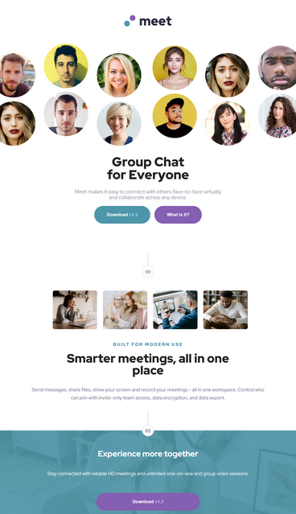
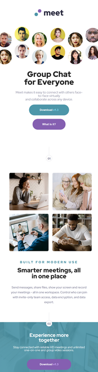

# Meet landing page solution

## Table of contents

- [Overview](#overview)
  - [The challenge](#the-challenge)
  - [Screenshot](#screenshot)
  - [Links](#links)
- [My process](#my-process)
  - [Built with](#built-with)
  - [Continued development](#continued-development)
- [Author](#author)

## Overview

### The challenge

Users should be able to:

- View the optimal layout depending on their device's screen size
- See hover states for interactive elements

### Screenshot

Desktop version: 

Tablet version:

Mobile version:

### Links

- Production URL: [http://valentina-milicevic-prod-meet-landing-page.vercel.app](http://valentina-milicevic-prod-meet-landing-page.vercel.app)
- Development URL: [http://valentina-milicevic-dev-meet-landing-page.vercel.app](http://valentina-milicevic-dev-meet-landing-page.vercel.app)

## My process

### Built with

- Semantic HTML5 markup
- CSS custom properties
- Flexbox
- CSS Grid

### Continued development

- If I were to continue the development, I would like to break main CSS files into multiple 
in order to create easier to read structure.

## Author

- Website - [Valentina Milicevic](https://github.com/vanjamilicevic)
- Email - valentina.milicevic@quantoxtechnology.com